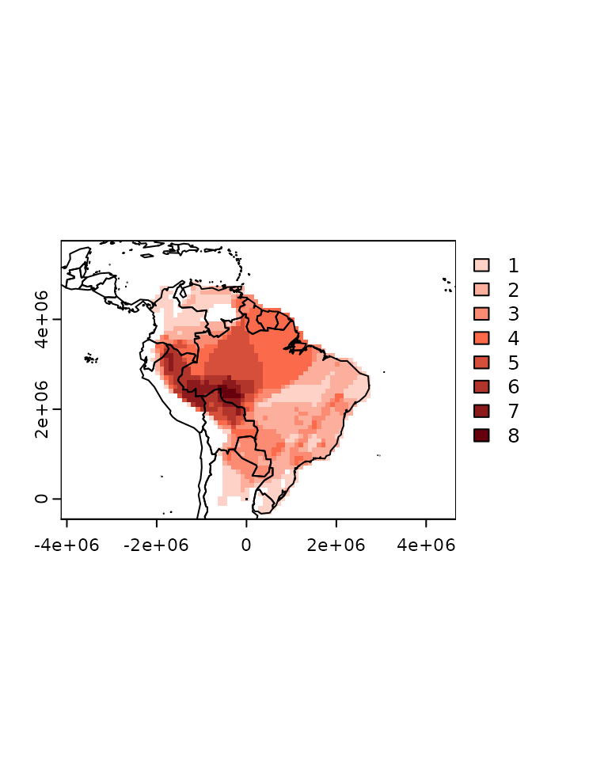
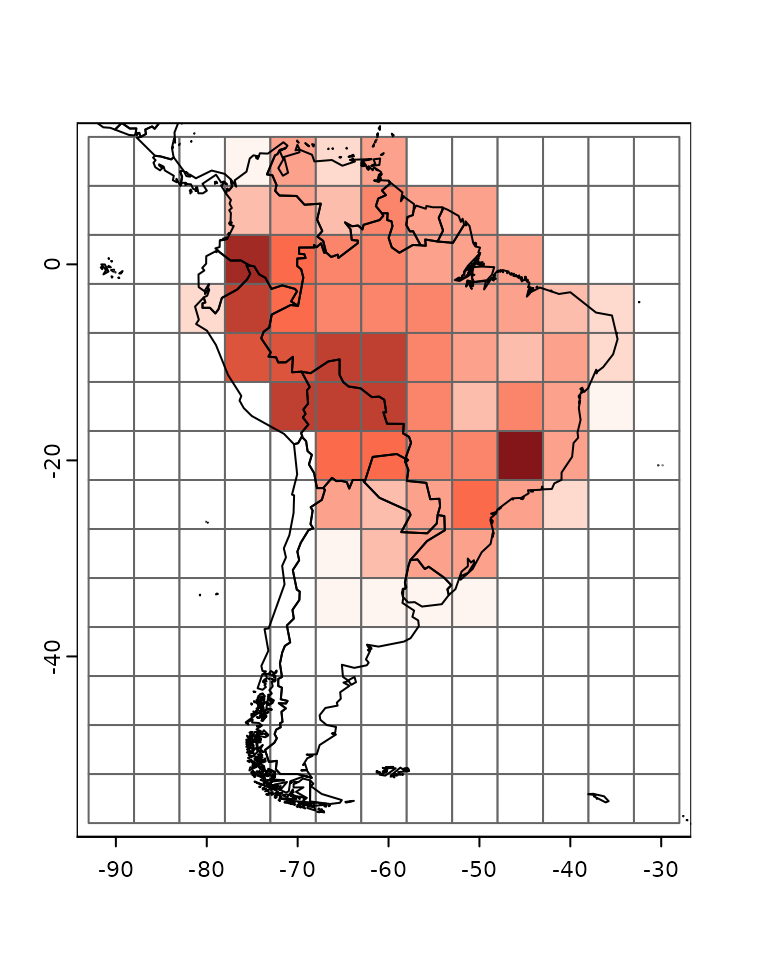

# A guide to transform species distributions into a presence absence matrix based on a user-defined grid in R

Species distributions are readily available in online databases, such as
the distribution ranges provided by IUCN or occurrence records found in
GBIF. However, analyzing this type of data often requires transforming
the spatial distribution of species into a presence-absence matrix or a
grid format. In this tutorial, we will guide you through a
straightforward process using the R package
[`letsR`](https://besjournals.onlinelibrary.wiley.com/doi/abs/10.1111/2041-210X.12401),
authored by [Bruno Vilela](https://bvilela.weebly.com) and [Fabricio
Villalobos](https://fabro.github.io).

## IUCN shapefiles

To begin, download the species distribution shapefiles from the IUCN
[website](https://www.iucnredlist.org/resources/spatial-data-download).
You can import this data using the
[`terra::vect`](https://rspatial.github.io/terra/reference/vect.html) or
[`sf::st_read`](https://r-spatial.github.io/sf/reference/st_read.html)
functions. For the purpose of this tutorial, I will be utilizing the
distribution data for frogs belonging to the Phyllomedusa genus, which
is conveniently pre-loaded within the `letsR` package.

``` r
library(letsR)

data("Phyllomedusa")
```

We can plot the data to see how it looks like.

``` r
# Plot
## Color settings and assignment
colors <- rainbow(length(unique(Phyllomedusa$binomial)),
                  alpha = 0.5)
position <- match(Phyllomedusa$binomial,
                  unique(Phyllomedusa$binomial))
colors <- colors[position]
## Plot call
plot(sf::st_geometry(Phyllomedusa), col = colors, lty = 0,
     main = "Spatial polygons of Phyllomedusa")
data("wrld_simpl")
plot(sf::st_geometry(wrld_simpl), add = TRUE)
```


### Quick start

Next step, we can use the function `lets.presab` to convert species’
ranges (in shapefile format) into a presence-absence matrix based on a
user-defined grid system. A simple way to do this is to define the
extent and resolution of the grid.

``` r
PAM <- lets.presab(Phyllomedusa, xmn = -93, xmx = -29,
                   ymn = -57, ymx = 15, res = 1)
```

Please be aware that when working with shapefiles containing numerous
species or opting for a high-resolution grid, the function’s execution
may become notably slow. In such instances, it is advisable to monitor
the relative running time of the analysis by enabling the `count = TRUE`
argument.

The `lets.presab` function yields a `PresenceAbsence` object (unless
`show.matrix = TRUE`, in which case only a presence-absence matrix is
returned). This object is essentially a list comprising a
presence-absence matrix, a raster containing geographical information,
and the species names. For additional details, refer to
[`?PresenceAbsence`](https://brunovilela.github.io/letsR/reference/PresenceAbsence.md).
To obtain summary information about the generated Presence-Absence
Matrix (PAM), the `summary` function can be employed.

``` r
summary(PAM)
```

    ## 
    ## Class: PresenceAbsence
    ## _ _
    ## Number of species: 32 
    ## Number of cells: 1187
    ## Cells with presence: 1187
    ## Cells without presence: 0
    ## Species without presence: 0
    ## Species with the largest range: Phyllomedusa hypochondrialis
    ## _ _
    ## Grid parameters
    ## Resolution: 1, 1 (x, y)
    ## Extention: -93, -29, -57, 15 (xmin, xmax, ymin, ymax)
    ## Coord. Ref.:  +proj=longlat +datum=WGS84 +no_defs

You can also use the `plot` function directly to the PAM object.

``` r
plot(PAM)
```


The `plot` function also allow users to plot specific species
distributions. For example, we can plot the map of *Phyllomedusa
hypochondrialis*:

``` r
plot(PAM, name = "Phyllomedusa hypochondrialis")
```


As said before, the PAM object contains the actual presence absence
matrix, to access it we can use the following code:

``` r
presab <- PAM$Presence_and_Absence_Matrix
```

The first two columns of the matrix contain the longitude (x) and
latitude (y) of the cells’ centroid, the following columns include the
species’ presence(1) and absence(0) information.

``` r
# Print only the first 5 rows and 3 columns
presab[1:5, 1:3]
```

    ##      Longitude(x) Latitude(y) Phyllomedusa araguari
    ## [1,]        -74.5        11.5                     0
    ## [2,]        -69.5        11.5                     0
    ## [3,]        -68.5        11.5                     0
    ## [4,]        -75.5        10.5                     0
    ## [5,]        -74.5        10.5                     0

### Using different projections

Some users may want to use different projections to generate the
presence absence matrix. The `lets.presab` function allow users to do it
by changing the `crs.grid` argument. Check the example using the South
America Equidistant Conic projection.

``` r
pro <- paste("+proj=eqdc +lat_0=-32 +lon_0=-60 +lat_1=-5",
             "+lat_2=-42 +x_0=0 +y_0=0 +ellps=aust_SA", 
             "+units=m +no_defs")
SA_EC <- terra::crs(pro)
PAM_proj <- lets.presab(Phyllomedusa, xmn = -4135157,
                        xmx = 4707602,
                        ymn = -450000, ymx = 5774733,
                        res = 100000,
                        crs.grid = SA_EC)
```

``` r
summary(PAM_proj)
```

    ## 
    ## Class: PresenceAbsence
    ## _ _
    ## Number of species: 32 
    ## Number of cells: 1396
    ## Cells with presence: 1396
    ## Cells without presence: 0
    ## Species without presence: 0
    ## Species with the largest range: Phyllomedusa hypochondrialis
    ## _ _
    ## Grid parameters
    ## Resolution: 1e+05, 1e+05 (x, y)
    ## Extention: -4135157, 4664843, -450000, 5750000 (xmin, xmax, ymin, ymax)
    ## Coord. Ref.:  +proj=eqdc +lat_0=-32 +lon_0=-60 +lat_1=-5 +lat_2=-42 +x_0=0 +y_0=0 +ellps=aust_SA +units=m +no_defs

``` r
plot(PAM_proj)
# Add projected country boundaries
data("wrld_simpl")
plot(sf::st_transform(sf::st_geometry(wrld_simpl), pro), add = TRUE)
```



### Other features

The function `lets.presab` has some other useful arguments. For
instance, users may wish to exclude regions where species are extinct or
retain only the breeding ranges. The `presence`, `origin`, and
`seasonal` arguments enable users to filter species distributions based
on the IUCN classification of different parts of a species’ range. To
find the specific values for these arguments, consult the [IUCN metadata
files](https://www.iucnredlist.org/resources/spatial-data-download).

In certain scenarios, it proves advantageous to consider a species
present in a cell only if it covers more than a specified percentage
value. Users can customize this threshold using the `cover` argument.
It’s important to note that initially, this option is exclusively
available when the coordinates are in degrees (longitude/latitude).
However, with the latest update on
[GitHub](https://github.com/macroecology/letsR), users can now employ
the `cover` argument with other projections as well.

``` r
# 90% cover
PAM_90 <- lets.presab(Phyllomedusa, xmn = -93,
                      xmx = -29, ymn = -57,
                      ymx = 15, res = 1,
                      cover = 0.9)
plot(PAM_90)
```


Observing the plot above, it’s evident that cells near the continent’s
border no longer reflect the presence of the species.

When generating multiple `PresenceAbsence` objects for distinct groups,
users might prefer to maintain a consistent grid. To achieve this, it’s
crucial to retain the `remove.cells = FALSE` argument, preventing any
modification to the grid. Conversely, setting `remove.cells = TRUE`
excludes cells with a value of zero in the final matrix, meaning sites
where no species are present won’t be included.

``` r
PAM_keep_cells <- lets.presab(Phyllomedusa, xmn = -93,
                              xmx = -29, ymn = -57,
                              ymx = 15, res = 1,
                              remove.cells = FALSE)
```

You can now employ the `summary` function to confirm whether the empty
cells were retained.

``` r
summary(PAM_keep_cells)
```

    ## 
    ## Class: PresenceAbsence
    ## _ _
    ## Number of species: 32 
    ## Number of cells: 4608
    ## Cells with presence: 1187
    ## Cells without presence: 3421
    ## Species without presence: 0
    ## Species with the largest range: Phyllomedusa hypochondrialis
    ## _ _
    ## Grid parameters
    ## Resolution: 1, 1 (x, y)
    ## Extention: -93, -29, -57, 15 (xmin, xmax, ymin, ymax)
    ## Coord. Ref.:  +proj=longlat +datum=WGS84 +no_defs

Additionally, for users intending to retain species that do not occur in
any cell of the grid, it is essential to configure `remove.sp = FALSE`.

## Occurrence data (e.g. GBIF)

Another prevalent source of spatial data is occurrence records. The
`lets.presab.points` function enables users to input these records,
generating a `PresenceAbsence` object. To utilize this function, you’ll
need a two-column matrix containing longitude and latitude, along with a
vector indicating the species name for each occurrence record. In the
example below, we are going to simulate random occurrence points.

``` r
species <- c(rep("sp1", 100), rep("sp2", 100),
             rep("sp3", 100), rep("sp4", 100))
x <- runif(400, min = -69, max = -51)
y <- runif(400, min = -23, max = -4)
xy <- cbind(x, y)
```

Now that we have the coordinates and species name, we can use the
`lets.presab.points` function.

``` r
PAM_points <- lets.presab.points(xy, species, xmn = -93, xmx = -29,
                          ymn = -57, ymx = 15)
plot(PAM_points)
```


## Using your own grid

For different reasons some users may want to create a presence absence
matrix based on their own grid in shapefile format. The function
`lets.presab.grid` allow users to convert species’ ranges into a
presence-absence matrix based on a grid in shapefile format. However,
this function only returns the actual matrix of presence absence and the
grid, not an `PresenceAbsence` object. In some situations it is possible
to convert this result to a `PresenceAbsence` object, I will cover this
in a new post soon. Let’s first create our grid:

``` r
# Grid 
sp.r <- terra::as.polygons(terra::rast(xmin = -93, xmax = -29,
                                ymin = -57, ymax = 15,
                                resolution = 5))
# Give an ID to the cell
sp.r$ID <- 1:length(sp.r)
plot(sp.r, border = rgb(.5, .5, .5))
plot(sf::st_geometry(wrld_simpl[1]), add = T, fill = F)
```


Now we can build our presence absence matrix from the grid.

``` r
resu <- lets.presab.grid(Phyllomedusa, sp.r, "ID")
```

The result is a list with the presence absence matrix and the grid. To
plot the richness map we can use the following code:

``` r
rich_plus1 <- rowSums(resu$PAM[, -1]) + 1
colfunc <- colorRampPalette(c("#fff5f0", "#fb6a4a", "#67000d"))
colors <- c("white", colfunc(max(rich_plus1)))
plot(resu$grid, border = "gray40",
     col = colors[rich_plus1])
plot(sf::st_geometry(wrld_simpl), add = TRUE)
```



This covers all the functions to convert species distribution into
presence absence matrix using the `letsR` package. Let me know if you
have any suggestion or comments, and please share if you like it.

**To cite letsR in publications use:** *Bruno Vilela and Fabricio
Villalobos (2015). letsR: a new R package for data handling and analysis
in macroecology. Methods in Ecology and Evolution. DOI:
10.1111/2041-210X.12401*
