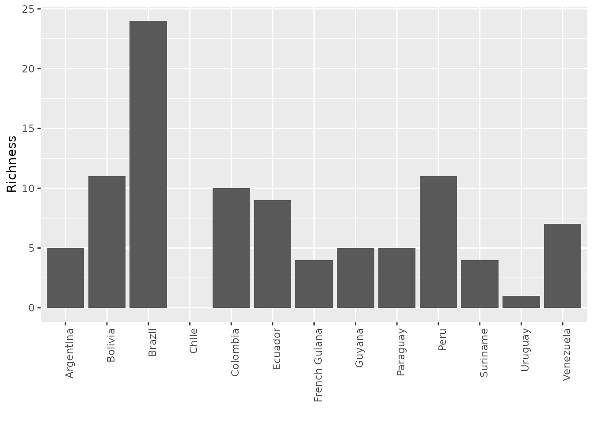

# Adding variables to a PresenceAbsence object

Once you have transformed species distribution data into a presence
absence matrix (PAM) in `PresenceAbsence` format, you may wish to
enhance it by incorporating additional variables. These variables
typically exist in raster format, such as WorldClim bioclimatic data, or
in shapefile format, for instance, global ecoregions.

### Adding variables in raster format

To add variables in raster format to a `PresenceAbsence` object we can
use the function `lets.addvar` from the `letsR` package. This function
takes a `raster` object with any resolution and extent, and transform it
to match the information in your `PresenceAbsence` object. Subsequently,
the variables are included as additional columns containing the
aggregate/summarize value of the variable(s) in each cell of the
presence-absence matrix. Let’s see an example using the bioclimatic data
from WorldClim.

``` r
library(letsR)
```

Here we will use the Average temperature raster in Celsius degrees
(multiplied by 100) for the world in 10 arc min of resolution.

``` r
data(temp)
r <- terra::unwrap(temp) # example data

plot(r)
```


Here I will use the `PresenceAbsence` object for Phyllomedusa species
previously generated.

``` r
data(PAM)
plot(PAM, main = "Phyllomedusa\nRichness")
```


We can now run the `lets.addvar` function. Just make sure that the two
objects are on the same projection before using the function. Also, note
that the climatic data have a higher resolution than our PAM. In this
case, we could choose a function to aggregate the values with the
argument `fun`. In most of the situations, people will be interested in
averaging values to aggregate multiple cells, but in some specific cases
you may want to sum them, or get the standard deviation, or use any
another function.

``` r
PAM_env <- lets.addvar(PAM, r, fun = mean)
#> Warning in lets.addvar(PAM, r, fun = mean): Reprojecting y to match the
#> projection in x
```

The result is a presence absence matrix, where the last columns now
include the raster values. Check the table:

``` r
head(PAM_env)
```

| Longitude(x) | Latitude(y) | Phyllomedusa araguari | Phyllomedusa atelopoides | Phyllomedusa ayeaye | Phyllomedusa azurea | Phyllomedusa bahiana | Phyllomedusa baltea | Phyllomedusa bicolor | Phyllomedusa boliviana | Phyllomedusa burmeisteri | Phyllomedusa camba | Phyllomedusa centralis | Phyllomedusa coelestis | Phyllomedusa distincta | Phyllomedusa duellmani | Phyllomedusa ecuatoriana | Phyllomedusa hypochondrialis | Phyllomedusa iheringii | Phyllomedusa itacolomi | Phyllomedusa megacephala | Phyllomedusa neildi | Phyllomedusa nordestina | Phyllomedusa oreades | Phyllomedusa palliata | Phyllomedusa perinesos | Phyllomedusa rohdei | Phyllomedusa sauvagii | Phyllomedusa tarsius | Phyllomedusa tetraploidea | Phyllomedusa tomopterna | Phyllomedusa trinitatis | Phyllomedusa vaillantii | Phyllomedusa venusta | wc2.1_10m_bio_1_mean |
|-------------:|------------:|----------------------:|-------------------------:|--------------------:|--------------------:|---------------------:|--------------------:|---------------------:|-----------------------:|-------------------------:|-------------------:|-----------------------:|-----------------------:|-----------------------:|-----------------------:|-------------------------:|-----------------------------:|-----------------------:|-----------------------:|-------------------------:|--------------------:|------------------------:|---------------------:|----------------------:|-----------------------:|--------------------:|----------------------:|---------------------:|--------------------------:|------------------------:|------------------------:|------------------------:|---------------------:|---------------------:|
|        -74.5 |        11.5 |                     0 |                        0 |                   0 |                   0 |                    0 |                   0 |                    0 |                      0 |                        0 |                  0 |                      0 |                      0 |                      0 |                      0 |                        0 |                            0 |                      0 |                      0 |                        0 |                   0 |                       0 |                    0 |                     0 |                      0 |                   0 |                     0 |                    0 |                         0 |                       0 |                       0 |                       0 |                    1 |             26.67511 |
|        -69.5 |        11.5 |                     0 |                        0 |                   0 |                   0 |                    0 |                   0 |                    0 |                      0 |                        0 |                  0 |                      0 |                      0 |                      0 |                      0 |                        0 |                            0 |                      0 |                      0 |                        0 |                   1 |                       0 |                    0 |                     0 |                      0 |                   0 |                     0 |                    0 |                         0 |                       0 |                       1 |                       0 |                    0 |             26.38072 |
|        -68.5 |        11.5 |                     0 |                        0 |                   0 |                   0 |                    0 |                   0 |                    0 |                      0 |                        0 |                  0 |                      0 |                      0 |                      0 |                      0 |                        0 |                            0 |                      0 |                      0 |                        0 |                   0 |                       0 |                    0 |                     0 |                      0 |                   0 |                     0 |                    0 |                         0 |                       0 |                       1 |                       0 |                    0 |             26.75012 |
|        -75.5 |        10.5 |                     0 |                        0 |                   0 |                   0 |                    0 |                   0 |                    0 |                      0 |                        0 |                  0 |                      0 |                      0 |                      0 |                      0 |                        0 |                            0 |                      0 |                      0 |                        0 |                   0 |                       0 |                    0 |                     0 |                      0 |                   0 |                     0 |                    0 |                         0 |                       0 |                       0 |                       0 |                    1 |             27.59441 |
|        -74.5 |        10.5 |                     0 |                        0 |                   0 |                   0 |                    0 |                   0 |                    0 |                      0 |                        0 |                  0 |                      0 |                      0 |                      0 |                      0 |                        0 |                            0 |                      0 |                      0 |                        0 |                   0 |                       0 |                    0 |                     0 |                      0 |                   0 |                     0 |                    0 |                         0 |                       0 |                       0 |                       0 |                    1 |             27.69106 |
|        -69.5 |        10.5 |                     0 |                        0 |                   0 |                   0 |                    0 |                   0 |                    0 |                      0 |                        0 |                  0 |                      0 |                      0 |                      0 |                      0 |                        0 |                            0 |                      0 |                      0 |                        0 |                   1 |                       0 |                    0 |                     0 |                      0 |                   0 |                     0 |                    0 |                         0 |                       0 |                       1 |                       0 |                    0 |             24.01917 |

If you do not want the coordinates and species included you can set the
argument `onlyvar = TRUE`.

``` r
climate <- lets.addvar(PAM, r, fun = mean, onlyvar = TRUE)
#> Warning in lets.addvar(PAM, r, fun = mean, onlyvar = TRUE): Reprojecting y to
#> match the projection in x
```

``` r
head(climate)
```

| wc2.1_10m_bio_1_mean |
|---------------------:|
|             26.67511 |
|             26.38072 |
|             26.75012 |
|             27.59441 |
|             27.69106 |
|             24.01917 |

Now that we have the variables, we can use it to relate to our species
data in many ways. For example, you could graph the relationship between
temperature and species richness.

``` r
library(ggplot2)
```

``` r
rich <- rowSums(PAM$P[, -(1:2)])

mpg1 <- data.frame("Temperature" = climate[, 1]/10,
                   "Richness" = rich)
ggplot(mpg1, aes(Temperature, Richness)) + 
  geom_smooth() + 
  geom_point(col = rgb(0, 0, 0, .6)) + 
  theme_bw()
```


### Adding variables in polygon format

Data in shapefile format like ecorregions, conservation units or
countries, can be added to a PAM using the function `lets.addpoly`. This
function adds polygons’ attributes as columns at the right-end of the
matrix. The values represent the percentage of the cell covered by the
polygon attribute used. As an example, we can use the South America
countries map available in the package `maptools`.

``` r
data("wrld_simpl")
SA <- c("Brazil", "Colombia",  "Argentina",
        "Peru", "Venezuela", "Chile",
        "Ecuador", "Bolivia", "Paraguay",
        "Uruguay", "Guyana", "Suriname",
        "French Guiana")
south_ame <- wrld_simpl[wrld_simpl$NAME %in% SA, ]
ggplot(data = south_ame) +
  geom_sf() +
  geom_sf_text(aes(label = ISO3)) +
  theme_bw()
```


Now we can add this variables to our PAM.

``` r
PAM_pol <- lets.addpoly(PAM, south_ame, "NAME")
```

``` r
head(PAM_pol)
```

| Longitude(x) | Latitude(y) | Phyllomedusa araguari | Phyllomedusa atelopoides | Phyllomedusa ayeaye | Phyllomedusa azurea | Phyllomedusa bahiana | Phyllomedusa baltea | Phyllomedusa bicolor | Phyllomedusa boliviana | Phyllomedusa burmeisteri | Phyllomedusa camba | Phyllomedusa centralis | Phyllomedusa coelestis | Phyllomedusa distincta | Phyllomedusa duellmani | Phyllomedusa ecuatoriana | Phyllomedusa hypochondrialis | Phyllomedusa iheringii | Phyllomedusa itacolomi | Phyllomedusa megacephala | Phyllomedusa neildi | Phyllomedusa nordestina | Phyllomedusa oreades | Phyllomedusa palliata | Phyllomedusa perinesos | Phyllomedusa rohdei | Phyllomedusa sauvagii | Phyllomedusa tarsius | Phyllomedusa tetraploidea | Phyllomedusa tomopterna | Phyllomedusa trinitatis | Phyllomedusa vaillantii | Phyllomedusa venusta | Argentina | Bolivia | Brazil | Chile | Colombia | Ecuador | French Guiana | Guyana | Suriname | Paraguay | Peru | Uruguay | Venezuela |
|-------------:|------------:|----------------------:|-------------------------:|--------------------:|--------------------:|---------------------:|--------------------:|---------------------:|-----------------------:|-------------------------:|-------------------:|-----------------------:|-----------------------:|-----------------------:|-----------------------:|-------------------------:|-----------------------------:|-----------------------:|-----------------------:|-------------------------:|--------------------:|------------------------:|---------------------:|----------------------:|-----------------------:|--------------------:|----------------------:|---------------------:|--------------------------:|------------------------:|------------------------:|------------------------:|---------------------:|----------:|--------:|-------:|------:|---------:|--------:|--------------:|-------:|---------:|---------:|-----:|--------:|----------:|
|        -74.5 |        11.5 |                     0 |                        0 |                   0 |                   0 |                    0 |                   0 |                    0 |                      0 |                        0 |                  0 |                      0 |                      0 |                      0 |                      0 |                        0 |                            0 |                      0 |                      0 |                        0 |                   0 |                       0 |                    0 |                     0 |                      0 |                   0 |                     0 |                    0 |                         0 |                       0 |                       0 |                       0 |                    1 |         0 |       0 |      0 |     0 |   0.1231 |       0 |             0 |      0 |        0 |        0 |    0 |       0 |    0.0000 |
|        -69.5 |        11.5 |                     0 |                        0 |                   0 |                   0 |                    0 |                   0 |                    0 |                      0 |                        0 |                  0 |                      0 |                      0 |                      0 |                      0 |                        0 |                            0 |                      0 |                      0 |                        0 |                   1 |                       0 |                    0 |                     0 |                      0 |                   0 |                     0 |                    0 |                         0 |                       0 |                       1 |                       0 |                    0 |         0 |       0 |      0 |     0 |   0.0000 |       0 |             0 |      0 |        0 |        0 |    0 |       0 |    0.5744 |
|        -68.5 |        11.5 |                     0 |                        0 |                   0 |                   0 |                    0 |                   0 |                    0 |                      0 |                        0 |                  0 |                      0 |                      0 |                      0 |                      0 |                        0 |                            0 |                      0 |                      0 |                        0 |                   0 |                       0 |                    0 |                     0 |                      0 |                   0 |                     0 |                    0 |                         0 |                       0 |                       1 |                       0 |                    0 |         0 |       0 |      0 |     0 |   0.0000 |       0 |             0 |      0 |        0 |        0 |    0 |       0 |    0.1744 |
|        -75.5 |        10.5 |                     0 |                        0 |                   0 |                   0 |                    0 |                   0 |                    0 |                      0 |                        0 |                  0 |                      0 |                      0 |                      0 |                      0 |                        0 |                            0 |                      0 |                      0 |                        0 |                   0 |                       0 |                    0 |                     0 |                      0 |                   0 |                     0 |                    0 |                         0 |                       0 |                       0 |                       0 |                    1 |         0 |       0 |      0 |     0 |   0.3333 |       0 |             0 |      0 |        0 |        0 |    0 |       0 |    0.0000 |
|        -74.5 |        10.5 |                     0 |                        0 |                   0 |                   0 |                    0 |                   0 |                    0 |                      0 |                        0 |                  0 |                      0 |                      0 |                      0 |                      0 |                        0 |                            0 |                      0 |                      0 |                        0 |                   0 |                       0 |                    0 |                     0 |                      0 |                   0 |                     0 |                    0 |                         0 |                       0 |                       0 |                       0 |                    1 |         0 |       0 |      0 |     0 |   0.9641 |       0 |             0 |      0 |        0 |        0 |    0 |       0 |    0.0000 |
|        -69.5 |        10.5 |                     0 |                        0 |                   0 |                   0 |                    0 |                   0 |                    0 |                      0 |                        0 |                  0 |                      0 |                      0 |                      0 |                      0 |                        0 |                            0 |                      0 |                      0 |                        0 |                   1 |                       0 |                    0 |                     0 |                      0 |                   0 |                     0 |                    0 |                         0 |                       0 |                       1 |                       0 |                    0 |         0 |       0 |      0 |     0 |   0.0000 |       0 |             0 |      0 |        0 |        0 |    0 |       0 |    1.0000 |

This information can be used to calculate the number of species per
country for example.

``` r
vars_col <- (ncol(PAM$P) + 1):ncol(PAM_pol)
n <- length(vars_col)
rich_count <- numeric(n)
for (i in 1:n) {
  rich_count[i] <- sum(colSums(PAM$P[PAM_pol[, vars_col[i]] > 0,
                                     -(1:2)]) > 0)
}
labs <- as.factor(colnames(PAM_pol)[vars_col])
names(rich_count) <- labs
```

``` r
mpg <- data.frame("Richness" = rich_count, "Country" = as.factor(labs))
g <- ggplot(mpg, aes(labs, Richness))
g + geom_bar(stat = "identity") + labs(x = "") +
  theme(axis.text.x = element_text(angle = 90, hjust = 1))
```



**To cite letsR in publications use:** *Bruno Vilela and Fabricio
Villalobos (2015). letsR: a new R package for data handling and analysis
in macroecology. Methods in Ecology and Evolution. DOI:
10.1111/2041-210X.12401*
