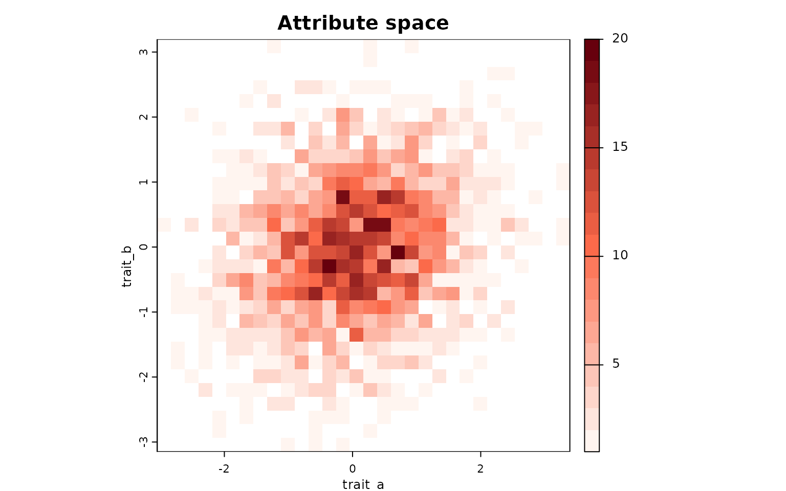
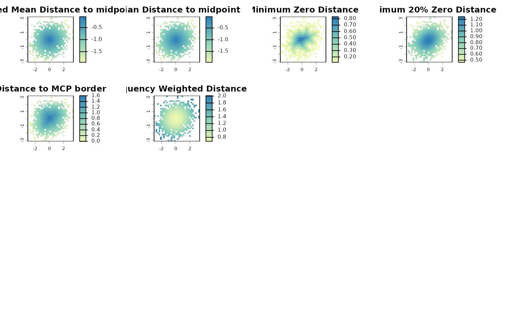
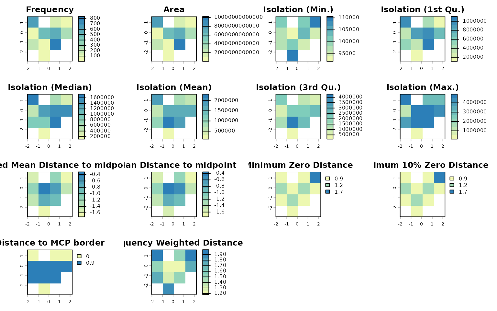

# Mapping species richness in attribute space

## Overview

Species richness and community structure can also be represented in
attribute space, where axes correspond to any quantitative information
that can be attributed to a species. The `letsR` package provides tools
to construct and analyze presence–absence matrices (PAMs) in attribute
space, allowing researchers to examine biodiversity patterns beyond
geography and environment.

This vignette demonstrates how to:

1.  Build a PAM in attribute space using
    [`lets.attrpam()`](https://brunovilela.github.io/letsR/reference/lets.attrpam.md);
2.  Visualize species richness with
    [`lets.plot.attrpam()`](https://brunovilela.github.io/letsR/reference/lets.plot.attrpam.md);
3.  Compute descriptors per attribute cell using
    [`lets.attrcells()`](https://brunovilela.github.io/letsR/reference/lets.attrcells.md);
4.  Aggregate descriptors to the species level with
    `lets.summarizer.cells()`; and
5.  Cross-map attribute metrics to geographic space for integrative
    analysis.

``` r
# Load the package
library(letsR)
```

## Simulating trait data and building the attribute space PAM

We begin by generating a dataset of 2,000 species with two correlated
traits:

``` r
set.seed(123)
n <- 2000
Species  <- paste0("sp", 1:n)
trait_a  <- rnorm(n)
trait_b  <- trait_a * 0.2 + rnorm(n)
df       <- data.frame(Species, trait_a, trait_b)

# Build the attribute-space PAM
attr_obj <- lets.attrpam(df, n_bins = 30)
```

## Visualizing richness in attribute space

The
[`lets.plot.attrpam()`](https://brunovilela.github.io/letsR/reference/lets.plot.attrpam.md)
function plots the richness surface across the bivariate trait space.

``` r
lets.plot.attrpam(attr_obj)
```



Each cell represents a unique combination of traits (binned values of
`trait_a` and `trait_b`), and the color intensity indicates the number
of species falling within that bin.

## Computing attribute-space descriptors

The function
[`lets.attrcells()`](https://brunovilela.github.io/letsR/reference/lets.attrcells.md)
quantifies structural properties of each cell in the trait space,
including measures of centrality, isolation, and border proximity.

``` r
attr_desc <- lets.attrcells(attr_obj, perc = 0.2)
head(attr_desc)
#>   Cell_attr Weighted Mean Distance to midpoint Mean Distance to midpoint
#> 3         1                          -2.326864                 -2.353019
#> 4         2                          -2.249095                 -2.275839
#> 5         3                          -2.174679                 -2.202012
#> 6         4                          -2.103971                 -2.131885
#> 7         5                          -2.037358                 -2.065836
#> 8         6                          -1.975254                 -2.004267
#>   Minimum Zero Distance Minimum 20% Zero Distance Distance to MCP border
#> 3                     0                 0.7875427                      0
#> 4                     0                 0.7238193                      0
#> 5                     0                 0.6742795                      0
#> 6                     0                 0.6362405                      0
#> 7                     0                 0.6116810                      0
#> 8                     0                 0.5974101                      0
#>   Frequency Weighted Distance
#> 3                    2.401182
#> 4                    2.325796
#> 5                    2.253747
#> 6                    2.185353
#> 7                    2.120959
#> 8                    2.060930
```

We can visualize these metrics using
[`lets.plot.attrcells()`](https://brunovilela.github.io/letsR/reference/lets.plot.attrcells.md):

``` r
lets.plot.attrcells(attr_obj, attr_desc)
```



Each panel represents a different descriptor (e.g., distance to
midpoint, distance to border, weighted isolation) mapped across the
trait space.

## Summarizing descriptors by species

To derive species-level summaries, we can aggregate descriptor values
across all cells occupied by each species using the
`lets.summarizer.cells()` function.

``` r
attr_desc_by_sp <- lets.summaryze.cells(attr_obj, attr_desc, func = mean)
head(attr_desc_by_sp)
#>   Species Weighted Mean Distance to midpoint Mean Distance to midpoint
#> 1     sp1                        -0.50820192                -0.4896199
#> 2     sp2                        -0.12253919                -0.1470435
#> 3     sp3                        -0.84093748                -0.8298832
#> 4     sp4                        -0.65172785                -0.6818160
#> 5     sp5                        -0.07626174                -0.1050365
#> 6     sp6                        -0.95462516                -0.9441664
#>   Minimum Zero Distance Minimum 20% Zero Distance Distance to MCP border
#> 1             0.4618802                 1.1195434              1.2701706
#> 2             0.8164966                 1.2218190              1.5011107
#> 3             0.3265986                 0.8310473              0.7745967
#> 4             0.2309401                 0.9311691              1.0392305
#> 5             0.8082904                 1.2360965              1.6041613
#> 6             0.2309401                 0.7661288              0.6733003
#>   Frequency Weighted Distance
#> 1                   0.8225743
#> 2                   0.6921972
#> 3                   1.0446166
#> 4                   0.9069837
#> 5                   0.6857976
#> 6                   1.1319803
```

This produces a data frame in which each row corresponds to a species,
and each column corresponds to the mean descriptor value across the
cells where that species occurs. \`

## Linking attribute space to geographic space

When a geographic PAM generated by
[`lets.presab()`](https://brunovilela.github.io/letsR/reference/lets.presab.md)
is supplied through the y argument,
[`lets.attrcells()`](https://brunovilela.github.io/letsR/reference/lets.attrcells.md)
links the species occurring in each attribute cell to the geographic
cells occupied by those species. This enables the computation of
additional descriptors in geographic space.

``` r
data("PAM")

n <- length(PAM$Species_name)
Species <- PAM$Species_name
trait_a <- rnorm(n)
trait_b <- trait_a * 0.2 + rnorm(n)
df <- data.frame(Species, trait_a, trait_b)

x <- lets.attrpam(df, n_bins = 4)

cell_desc_geo <- lets.attrcells(x, y = PAM)
head(cell_desc_geo)
#>   Cell_attr Frequency         Area Isolation (Min.) Isolation (1st Qu.)
#> 3         1       625 7.610774e+12        101354.56            995744.9
#> 4         2         0 0.000000e+00             0.00                 0.0
#> 5         3       104 1.277753e+12        101354.56            435455.5
#> 6         4        15 1.822784e+11        110577.35            156797.2
#> 7         5        72 8.858890e+11         96965.99            322461.4
#> 8         6       497 6.048791e+12         91839.61            857643.9
#>   Isolation (Median) Isolation (Mean) Isolation (3rd Qu.) Isolation (Max.)
#> 3          1642232.9        1747128.1           2384391.6          4749476
#> 4                0.0              0.0                 0.0                0
#> 5           672554.2         722752.7            942685.7          2959492
#> 6           331739.8         644769.6            663456.3          2894931
#> 7           491756.2         513232.8            686374.2          1284485
#> 8          1352699.2        1517451.6           2012096.3          4548857
#>   Weighted Mean Distance to midpoint Mean Distance to midpoint
#> 3                         -1.5126554                -1.5627376
#> 4                         -1.0102709                -1.0708381
#> 5                         -1.1194498                -1.1624284
#> 6                         -1.7279145                -1.7480804
#> 7                         -1.1689967                -1.1913948
#> 8                         -0.3147603                -0.3520894
#>   Minimum Zero Distance Minimum 10% Zero Distance Distance to MCP border
#> 3             0.8660254                 0.8660254              0.0000000
#> 4             0.0000000                 0.0000000              0.0000000
#> 5             0.8660254                 0.8660254              0.0000000
#> 6             1.7320508                 1.7320508              0.0000000
#> 7             1.2247449                 1.2247449              0.8660254
#> 8             0.8660254                 0.8660254              0.8660254
#>   Frequency Weighted Distance
#> 3                    1.988764
#> 4                    1.385760
#> 5                    1.506749
#> 6                    1.928870
#> 7                    1.489442
#> 8                    1.181192
```

When `y` is provided, the output includes additional variables:

- `Frequency`: number of geographic cells associated with each attribute
  cell;
- `Area`: summed area of those geographic cells; and
- geographic isolation summaries:
  - `Isolation (Min.)`
  - `Isolation (1st Qu.)`
  - `Isolation (Median)`
  - `Isolation (Mean)`
  - `Isolation (3rd Qu.)`
  - `Isolation (Max.)`

These variables allow direct integration of position in attribute space
with occupancy and isolation patterns in geographic space.

The resulting descriptors can also be plotted:

``` r
lets.plot.attrcells(x, cell_desc_geo)
```



## References

Vilela, B. & Villalobos, F. (2015). letsR: a new R package for data
handling and analysis in macroecology. Methods in Ecology and Evolution,
6(10), 1229–1234.
