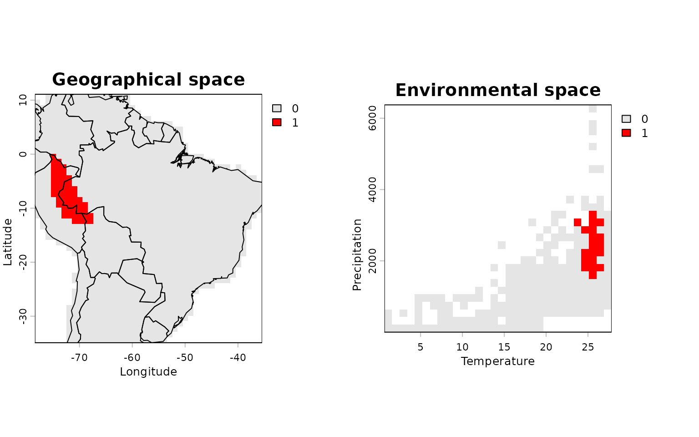
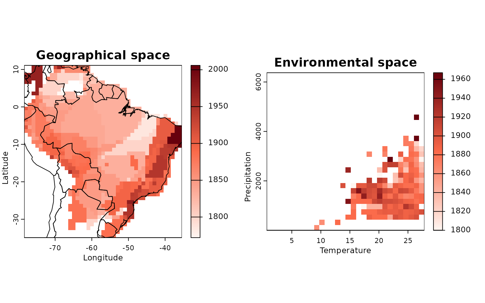
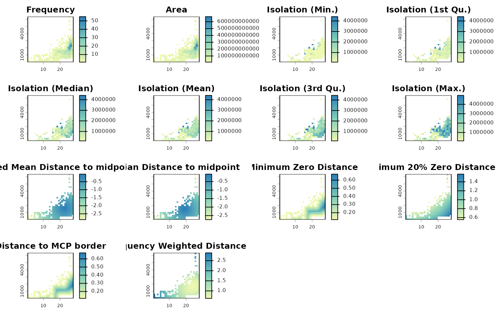

# Mapping species richness in environmental space

Species richness and distributions are often analyzed in geographic
space. However, understanding biodiversity in environmental space (e.g.,
across gradients of temperature and precipitation) is fundamental to
further understand ecological communities and species distribution.

The new function
[`lets.envpam()`](https://brunovilela.github.io/letsR/reference/lets.envpam.md)
from the `letsR` package allows users to transform a geographic
presence–absence matrix (PAM) into an environmental-space PAM, by
binning species occurrences according to environmental variables.

### Loading data

To start this test we can load our example datasets of `Phyllomedusa`
frog species occurrences and two environmental layers: temperature and
precipitation.

*Note: I recommend to use the latest version of the `letsR` package on
[GitHub](https://github.com/macroecology/letsR)*

``` r
# Load the package
library(letsR)

# Load species occurrences
data("Phyllomedusa")

# Load and unwrap environmental rasters
data("prec")
data("temp")
prec <- unwrap(prec)
temp <- unwrap(temp)
```

Notice that we need to generate a PAM without removing the cells without
records. We can also remove data beyond the geographic limits of
continents as the example species are continental organisms.

``` r
# Generate a geographic PAM
pam <- lets.presab(Phyllomedusa, remove.cells = FALSE)

# Crop the PAM to the world's landmasses
data("wrld_simpl", package = "letsR")
pam <- lets.pamcrop(pam, terra::vect(wrld_simpl))
```

Next, we need to add our environmental data to the pam using the
`lets.addvar` function. Note that we only need to keep the variables, so
set the `onlyvar` argument `TRUE`.

``` r
# Extract environmental values
envs <- lets.addvar(pam, c(temp, prec), onlyvar = TRUE)
colnames(envs) <- c("Temperature", "Precipitation")
```

### Creating a PAM in environmental space

We can now combine the `PresenceAbsence` object and the `envs` object to
create the presence absence matrix in the environmental space using the
`lets.envpam`function.

``` r
# Transform PAM into environmental space
res <- lets.envpam(pam, envs)
```

The resulting object `res` contains:

- `Presence_and_Absence_Matrix_env`: a matrix of species presence across
  environmental cells.  
- `Presence_and_Absence_Matrix_geo`: the original PAM coordinates
  associated with environmental cells.  
- `Env_Richness_Raster`: raster showing richness in binned environmental
  space.  
- `Geo_Richness_Raster`: the original richness raster in geographic
  space.

You will note that the environmental and geographic presence–absence
matrices share a common identifier: the `Cell_env` column. This linkage
allows users to perform integrated analyses, facilitating the transfer
of information between environmental and geographic spaces in both
directions.

``` r
res$Presence_and_Absence_Matrix_env[1:5, 1:5]
#>     Cell_env Temperature Precipitation Phyllomedusa araguari
#> 269      269    26.46848      4568.828                     0
#> 387      387    24.65896      3719.128                     0
#> 389      389    26.46848      3719.128                     0
#> 417      417    24.65896      3506.702                     0
#> 418      418    25.56372      3506.702                     0
#>     Phyllomedusa atelopoides
#> 269                        0
#> 387                        0
#> 389                        0
#> 417                        0
#> 418                        0
```

``` r
res$Presence_and_Absence_Matrix_geo[1:5, 1:5]
#>      Cell_env Cell_geo Longitude(x) Latitude(y) Phyllomedusa araguari
#> [1,]      750        3    -75.92399     10.5907                     0
#> [2,]      750        4    -74.92399     10.5907                     0
#> [3,]      715        5    -73.92399     10.5907                     0
#> [4,]      716        6    -72.92399     10.5907                     0
#> [5,]      780        7    -71.92399     10.5907                     0
```

### Visualizing environmental richness

The `letsR` package also offers a function to plot richness plot in both
environmental and geographic space.

``` r
lets.plot.envpam(res,
            world = TRUE)
```


This plot shows species richness both in geographic (left) and
environmental (right) space.

### Highlighting a single species

To visualize where a specific species occurs in both spaces:

``` r
lets.plot.envpam(res, species = "Phyllomedusa atelopoides")
```



## Mapping traits in environmental space

The function `lets.maplizer.env` also allow users to map species
attributes in both environmental and geographic spaces. Let’s use the
species description date available in the `IUCN` example object.

``` r
data("IUCN")
# Map mean description year
res_map <- lets.maplizer.env(res, 
                             y = IUCN$Description_Year, 
                             z = IUCN$Species)
```

The results are pretty similar to the `lets.envpam` results, except that
now instead of presence-absence for each species there will be the
summarized attribute. In this case the mean description year per cell.
You can also use the `lets.plot.envpam` function to visualize the
results (notice that you cannot plot individual species or cells in this
case).

``` r
# Plotting trait maps
lets.plot.envpam(res_map)
```



In sum, the
[`lets.envpam()`](https://brunovilela.github.io/letsR/reference/lets.envpam.md)
function offers a simple yet powerful way to explore biodiversity
patterns in environmental space. It enables users to:  
- Bin species distributions along ecological gradients.  
- Compare spatial and environmental richness.  
- Perform niche-based or trait-environment studies.

For advanced analyses, the resulting matrices and rasters can be used in
statistical models or overlaid with environmental constraints.

## Describing environmental–geographical structure

The object `res` links geographic and environmental spaces. We can
quantify that structure using
[`lets.envcells()`](https://brunovilela.github.io/letsR/reference/lets.envcells.md),
which returns per–environmental-cell descriptors such as frequency (how
many geographic cells map to the same environmental bin), geographic
isolation among those cells, distances to environmental midpoints
(negated so larger values imply higher “centrality”), and distances to
environmental borders.

## Summarize descriptors per environmental cell

``` r
out <- lets.envcells(res)  # perc controls the robust border metric
head(out)
#>   Cell_env Frequency Isolation (Min.) Isolation (1st Qu.) Isolation (Median)
#> 3        1         0               NA                  NA                 NA
#> 4        2         0               NA                  NA                 NA
#> 5        3         0               NA                  NA                 NA
#> 6        4         0               NA                  NA                 NA
#> 7        5         0               NA                  NA                 NA
#> 8        6         0               NA                  NA                 NA
#>   Isolation (Mean) Isolation (3rd Qu.) Isolation (Max.)
#> 3               NA                  NA               NA
#> 4               NA                  NA               NA
#> 5               NA                  NA               NA
#> 6               NA                  NA               NA
#> 7               NA                  NA               NA
#> 8               NA                  NA               NA
#>   Weighted Mean Distance to midpoint Mean Distance to midpoint
#> 3                          -3.730908                 -3.457246
#> 4                          -3.646836                 -3.382386
#> 5                          -3.564523                 -3.309862
#> 6                          -3.484092                 -3.239832
#> 7                          -3.405677                 -3.172460
#> 8                          -3.329421                 -3.107918
#>   Minimum Zero Distance Minimum 10% Zero Distance Distance to MCP border
#> 3                     0                 0.9362266                      0
#> 4                     0                 0.8700119                      0
#> 5                     0                 0.8136812                      0
#> 6                     0                 0.7676179                      0
#> 7                     0                 0.7323872                      0
#> 8                     0                 0.7068043                      0
#>   Frequency Weighted Distance
#> 3                    3.800462
#> 4                    3.718461
#> 5                    3.638213
#> 6                    3.559825
#> 7                    3.483411
#> 8                    3.409092
```

Key columns are:

Frequency: geographic aggregation into the same environmental cell.

Isolation: summary of pairwise geographic distances among geographic
cells mapped to that environmental bin.

Weighted Mean Distance to midpoint and Mean Distance to midpoint:
negated distances in standardized environmental space (larger = more
central).

Minimum Zero Distance, Minimum 10% Zero Distance (here 20% because perc
= 0.2), and Distance to MCP border: three proxies for environmental
“edge”.

Mapping descriptor layers

We can plot every descriptor over the environmental raster grid.
Optionally, set ras = TRUE to also retrieve the layers as a named list
of SpatRaster objects for further use.

### Plot the descriptors

Plot all descriptors (environmental grid)

``` r
lets.plot.envcells(res, out)
```



Optionally retrieve rasters for further analysis:

``` r
ras_list <- lets.plot.envcells(res, out, ras = TRUE, plot_ras = FALSE)
```

## Diagnosing centrality vs. richness (optional)

As a simple diagnostic, we may examine whether environmental centrality
(negated distance to the weighted midpoint) co-varies with environmental
richness.

``` r
centrality <- out[["Weighted Mean Distance to midpoint"]]   # larger = more central
rich_env   <- rowSums(res$Presence_and_Absence_Matrix_env[, -(1:3), drop = FALSE])

# Mantain cells without zero
keep <- res$Presence_and_Absence_Matrix_env[, 1]
centrality <- centrality[keep]


# Plot relationship
plot(centrality, rich_env,
     xlab = "Centrality (negated distance to weighted midpoint)",
     ylab = "Species richness",
     pch  = 19)
abline(lm(rich_env ~ centrality), lwd = 2)
```


These descriptors often reveal whether species accumulate in central
portions of environmental space or cluster near edges (where
zero-richness neighbors are close), thereby sharpening inference about
ecological filtering and range limits.

### References

- Vilela, B. & Villalobos, F. (2015). letsR: a new R package for data
  handling and analysis in macroecology. *Methods in Ecology and
  Evolution*, 6(10), 1229–1234.
