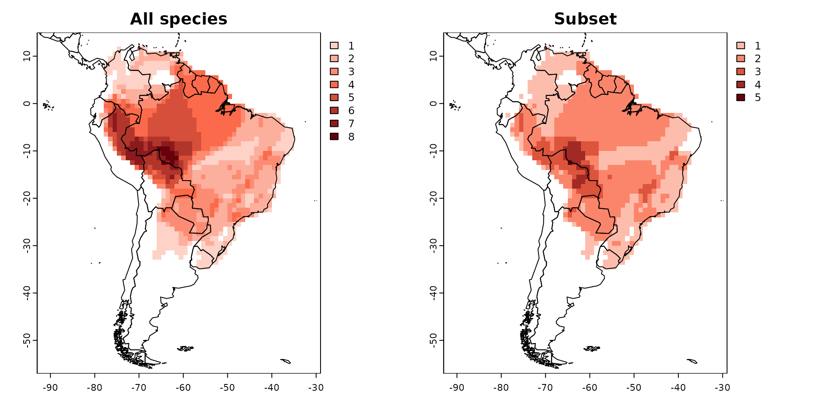
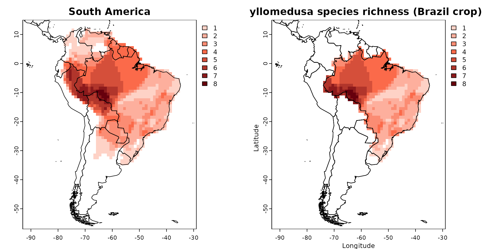

# Cropping and subseting your presence absence matrix

In this guide, we’ll dive into the technique of subsetting or cropping a
`PresenceAbsence` object.

To accomplish this task, we’ll use the `lets.subsetPAM` function. Just
let the function know which species you want to keep and provide the
`PresenceAbsence` object as input.

``` r
# Package
library(letsR)

# Data
data("PAM")

names <- PAM$Species_name[1:20] # keep only the first 20 names
PAM_subset <- lets.subsetPAM(PAM, names)
par(mfrow = c(1, 2))
plot(PAM, main = "All species")
plot(PAM_subset, main = "Subset")
```



You might also find it useful to crop your `PresenceAbsence` object to a
specific region using a shapefile. The `lets.pamcrop` function offers a
straightforward method to achieve this. For instance, let’s crop our
Presence-Absence Matrix (PAM) to the borders of Brazil.

``` r
data(wrld_simpl)  # World map
data(PAM)
Brazil <- wrld_simpl[wrld_simpl$NAME == "Brazil", ]  # Brazil (polygon)
PAM_crop <- lets.pamcrop(PAM, Brazil, remove.sp = TRUE)
par(mfrow = c(1, 2))
plot(PAM, main = "South America")
plot(PAM_crop, xlab = "Longitude", ylab = "Latitude",
     main = "Phyllomedusa species richness (Brazil crop)")
plot(sf::st_geometry(wrld_simpl), add = TRUE)
```



**To cite letsR in publications use:** *Bruno Vilela and Fabricio
Villalobos (2015). letsR: a new R package for data handling and analysis
in macroecology. Methods in Ecology and Evolution. DOI:
10.1111/2041-210X.12401*
