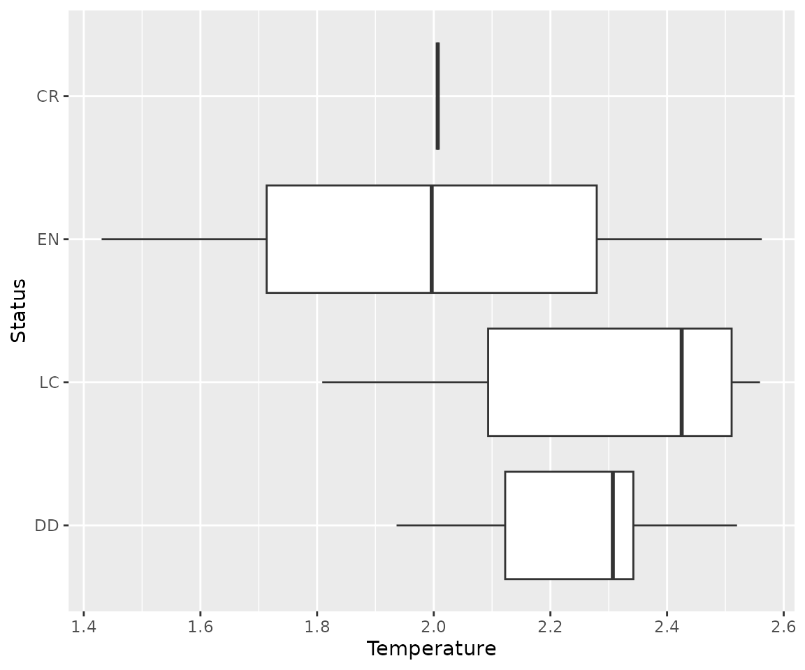

# Macroecological analysis at the species level

In another post, I have shown how to use
[`letsR`](https://besjournals.onlinelibrary.wiley.com/doi/abs/10.1111/2041-210X.12401)
to analyze species traits at the community level. But, in many cases
this type of analysis can lead to spurious patterns ([click here for
further discussion on this
issue](https://onlinelibrary.wiley.com/doi/full/10.1111/jbi.12953)). An
alternative can be analyzing the data at the species-level. In this
post, I will show two examples on how to make macroecological analysis
at the species level using the `letsR` package. In the first example, we
will continue the test of Rapoport’s rule on Phyllomedusa frogs using
species centroids. In the second example, we will summarize climate
spatial data at the species level to explore how temperature correlates
with Phyllomedusa species extinction risk.

To start this test we can load our example `PresenceAbsence` object.

*Note: I recommend to use the latest version of the `letsR` package on
[GitHub](https://github.com/macroecology/letsR)*

``` r
# Load the package
library(letsR)

# Load the data
data("PAM")

# Plot
plot(PAM)
```


## Example 1: Species level test of Rapoport’s rule on Phyllomedusa frogs.

We first have to calculate species range size. We can do it directly on
the species shapefiles for higher precision.

``` r
data("Phyllomedusa")
rangesize <- lets.rangesize(Phyllomedusa,
                            coordinates = "geographic")
rangesize <- rangesize / 1000 # Transform in km2
```

The second step is to calculate species geographical centroid/midpoint
using the function `lets.midpoint`. There are several ways to calculate
species geographic centroid, and this function offers several methods to
do it. When species range are both circular and continuous, all of the
methods will provide the same answer. However, as the shape of
distributions start to become more complex, different methods will
provide very different answers. For this example, we will use the
default option “PC” (polygon centroid). This method will generate a
polygon from the raster, and calculate the centroid of this polygon.

``` r
centroids <- lets.midpoint(PAM)
```

``` r
centroids
```

| Species                      |         x |          y |
|:-----------------------------|----------:|-----------:|
| Phyllomedusa araguari        | -47.50000 | -19.500000 |
| Phyllomedusa atelopoides     | -72.50000 |  -7.053571 |
| Phyllomedusa ayeaye          | -46.83333 | -20.833333 |
| Phyllomedusa azurea          | -56.49554 | -19.098214 |
| Phyllomedusa bahiana         | -40.03846 | -11.807692 |
| Phyllomedusa baltea          | -74.50000 |  -9.500000 |
| Phyllomedusa bicolor         | -60.87860 |  -3.374486 |
| Phyllomedusa boliviana       | -62.11165 | -15.082524 |
| Phyllomedusa burmeisteri     | -43.23684 | -17.912281 |
| Phyllomedusa camba           | -66.03398 | -11.995146 |
| Phyllomedusa centralis       | -55.50000 | -15.500000 |
| Phyllomedusa coelestis       | -76.07143 |  -3.857143 |
| Phyllomedusa distincta       | -48.08333 | -25.500000 |
| Phyllomedusa duellmani       | -77.50000 |  -5.500000 |
| Phyllomedusa ecuatoriana     | -78.50000 |  -2.500000 |
| Phyllomedusa hypochondrialis | -55.69363 |  -9.071974 |
| Phyllomedusa iheringii       | -53.59677 | -31.758064 |
| Phyllomedusa itacolomi       | -43.50000 | -20.500000 |
| Phyllomedusa megacephala     | -43.00000 | -19.500000 |
| Phyllomedusa neildi          | -69.50000 |  11.000000 |
| Phyllomedusa nordestina      | -40.66216 | -10.707207 |
| Phyllomedusa oreades         | -48.25000 | -14.750000 |
| Phyllomedusa palliata        | -69.82031 |  -9.289062 |
| Phyllomedusa perinesos       | -76.50000 |   0.500000 |
| Phyllomedusa rohdei          | -43.83333 | -21.981482 |
| Phyllomedusa sauvagii        | -60.04264 | -24.011628 |
| Phyllomedusa tarsius         | -67.12143 |  -4.596429 |
| Phyllomedusa tetraploidea    | -51.79630 | -24.074074 |
| Phyllomedusa tomopterna      | -62.56324 |  -4.081028 |
| Phyllomedusa trinitatis      | -65.77778 |  10.277778 |
| Phyllomedusa vaillantii      | -61.87419 |  -4.947312 |
| Phyllomedusa venusta         | -75.23077 |   7.461538 |

We can also plot the geographical centroids.

``` r
d <- data.frame(centroids[, 2:3], 
                "Species" = centroids[, 1], 
                "Range size" = rangesize)
sp <- terra::vect(x = d, geom  = c("x", "y"))
plot(sp)
plot(sf::st_geometry(wrld_simpl), add = TRUE)
```


To check the Rapoport’s rule we can plot the latitude against the range
size:

``` r
library(ggplot2)
```

``` r
data_plot <- data.frame(centroids[, 2:3], "Range size" = rangesize)
g <- ggplot(data_plot, aes(x, Range_size))
g + geom_smooth() + geom_point() + labs(x = "Latitude(x)", y = "Range size")
```


Again, the data indicate that Rapoport’s rule does not apply for
Phyllomedusa genus. However, there seems to be an interesting pattern
where range size decreases from the center towards the extremes of the
group. This could be an effect of niche conservatism, where species in
the extreme latitude would face very different conditions from the
ancestral Phylllomedusa. Another possibility is that this pattern could
be due to the shape of the continent, where extreme latitudes means
smaller longitudes.

## Example 2: Extinction risk correlation with temperature

To evaluate how temperature correlates with extinction risk, we first
have to add the temperature variable to the `PresenceAbsence` object.

``` r
data(temp)
r <- terra::unwrap(temp)
PAM_env <- lets.addvar(PAM, r, fun = mean)
#> Warning in lets.addvar(PAM, r, fun = mean): Reprojecting y to match the
#> projection in x
```

Next step is to get the average temperature values per species. The
`lets.summarizer` can do this directly on the resulting object of
`lets.addvar` function (note that this can only be done if
`onlyvar = FALSE`). We only have to indicate the position of the
variable in the matrix using the argument `pos`.

``` r
pos <- which(colnames(PAM_env) == "wc2.1_10m_bio_1_mean")
temp_mean <- lets.summarizer(PAM_env, pos)
```

``` r
temp_mean
```

| Species                      | wc2.1_10m_bio_1_mean |
|:-----------------------------|---------------------:|
| Phyllomedusa araguari        |             20.56603 |
| Phyllomedusa atelopoides     |             25.52649 |
| Phyllomedusa ayeaye          |             20.06813 |
| Phyllomedusa azurea          |             23.49658 |
| Phyllomedusa bahiana         |             23.10110 |
| Phyllomedusa baltea          |             25.62387 |
| Phyllomedusa bicolor         |                   NA |
| Phyllomedusa boliviana       |             24.17175 |
| Phyllomedusa burmeisteri     |             21.86432 |
| Phyllomedusa camba           |             24.93428 |
| Phyllomedusa centralis       |             23.34730 |
| Phyllomedusa coelestis       |             24.96714 |
| Phyllomedusa distincta       |             18.98532 |
| Phyllomedusa duellmani       |             21.59888 |
| Phyllomedusa ecuatoriana     |             14.30585 |
| Phyllomedusa hypochondrialis |                   NA |
| Phyllomedusa iheringii       |             18.08854 |
| Phyllomedusa itacolomi       |             19.36243 |
| Phyllomedusa megacephala     |             20.85050 |
| Phyllomedusa neildi          |             25.19995 |
| Phyllomedusa nordestina      |             23.96218 |
| Phyllomedusa oreades         |             23.07010 |
| Phyllomedusa palliata        |             25.15378 |
| Phyllomedusa perinesos       |             22.04672 |
| Phyllomedusa rohdei          |             20.62165 |
| Phyllomedusa sauvagii        |             22.33336 |
| Phyllomedusa tarsius         |             25.48131 |
| Phyllomedusa tetraploidea    |             20.37571 |
| Phyllomedusa tomopterna      |                   NA |
| Phyllomedusa trinitatis      |             25.59346 |
| Phyllomedusa vaillantii      |                   NA |
| Phyllomedusa venusta         |             24.33024 |

Following our example, we need to obtain the IUCN extinction risk data.
Previous version of the package included functions to do this, but they
are no longer supported. Luckily, there is a new package called
[`rredlist`](https://docs.ropensci.org/rredlist/) that can do this for
us. Yet, for now, we can use the example data in the `letsR` package
called `IUCN`.

``` r
data("IUCN")
```

``` r
IUCN
```

| Species                      | Family  | Status | Criteria           | Population | Description_Year | Country                                                                                    |
|:-----------------------------|:--------|:-------|:-------------------|:-----------|-----------------:|:-------------------------------------------------------------------------------------------|
| Phyllomedusa araguari        | HYLIDAE | DD     |                    | Unknown    |             2007 | Brazil                                                                                     |
| Phyllomedusa atelopoides     | HYLIDAE | LC     |                    | Unknown    |             1988 | Bolivia, Brazil, Peru                                                                      |
| Phyllomedusa ayeaye          | HYLIDAE | CR     | B1ab(iii)+2ab(iii) | Unknown    |             1966 | Brazil                                                                                     |
| Phyllomedusa azurea          | HYLIDAE | DD     |                    | Unknown    |             1862 | Argentina, Bolivia, Brazil, Paraguay                                                       |
| Phyllomedusa bahiana         | HYLIDAE | DD     |                    | Unknown    |             1925 | Brazil                                                                                     |
| Phyllomedusa baltea          | HYLIDAE | EN     | B1ab(iii)+2ab(iii) | Decreasing |             1979 | Peru                                                                                       |
| Phyllomedusa bicolor         | HYLIDAE | LC     |                    | Stable     |             1772 | Bolivia, Brazil, Colombia, French Guiana, Guyana, Peru, Suriname, Venezuela                |
| Phyllomedusa boliviana       | HYLIDAE | LC     |                    | Stable     |             1902 | Argentina, Bolivia, Brazil                                                                 |
| Phyllomedusa burmeisteri     | HYLIDAE | LC     |                    | Stable     |             1882 | Brazil                                                                                     |
| Phyllomedusa camba           | HYLIDAE | LC     |                    | Stable     |             2000 | Bolivia, Brazil, Peru                                                                      |
| Phyllomedusa centralis       | HYLIDAE | DD     |                    | Unknown    |             1965 | Brazil                                                                                     |
| Phyllomedusa coelestis       | HYLIDAE | LC     |                    | Unknown    |             1874 | Colombia, Ecuador, Peru                                                                    |
| Phyllomedusa distincta       | HYLIDAE | LC     |                    | Decreasing |             1950 | Brazil                                                                                     |
| Phyllomedusa duellmani       | HYLIDAE | DD     |                    | Unknown    |             1982 | Peru                                                                                       |
| Phyllomedusa ecuatoriana     | HYLIDAE | EN     | B1ab(iii)          | Decreasing |             1982 | Ecuador                                                                                    |
| Phyllomedusa hypochondrialis | HYLIDAE | LC     |                    | Stable     |             1800 | Argentina, Bolivia, Brazil, Colombia, French Guiana, Guyana, Paraguay, Suriname, Venezuela |
| Phyllomedusa iheringii       | HYLIDAE | LC     |                    | Unknown    |             1885 | Brazil, Uruguay                                                                            |
| Phyllomedusa itacolomi       | HYLIDAE | DD     |                    | Unknown    |             2006 | Brazil                                                                                     |
| Phyllomedusa megacephala     | HYLIDAE | DD     |                    | Unknown    |             1926 | Brazil                                                                                     |
| Phyllomedusa neildi          | HYLIDAE | DD     |                    | Unknown    |             2006 | Venezuela                                                                                  |
| Phyllomedusa nordestina      | HYLIDAE | DD     |                    | Unknown    |             2006 | Brazil                                                                                     |
| Phyllomedusa oreades         | HYLIDAE | DD     |                    | Unknown    |             2002 | Brazil                                                                                     |
| Phyllomedusa palliata        | HYLIDAE | LC     |                    | Stable     |             1873 | Bolivia, Brazil, Ecuador, Peru                                                             |
| Phyllomedusa perinesos       | HYLIDAE | DD     |                    | Unknown    |             1973 | Colombia, Ecuador                                                                          |
| Phyllomedusa rohdei          | HYLIDAE | LC     |                    | Stable     |             1926 | Brazil                                                                                     |
| Phyllomedusa sauvagii        | HYLIDAE | LC     |                    | Stable     |             1882 | Argentina, Bolivia, Brazil, Paraguay                                                       |
| Phyllomedusa tarsius         | HYLIDAE | LC     |                    | Stable     |             1868 | Brazil, Colombia, Ecuador, Peru, Venezuela                                                 |
| Phyllomedusa tetraploidea    | HYLIDAE | LC     |                    | Stable     |             1992 | Argentina, Brazil, Paraguay                                                                |
| Phyllomedusa tomopterna      | HYLIDAE | LC     |                    | Stable     |             1868 | Bolivia, Brazil, Colombia, Ecuador, French Guiana, Guyana, Peru, Suriname, Venezuela       |
| Phyllomedusa trinitatis      | HYLIDAE | LC     |                    | Stable     |             1926 | Trinidad and Tobago, Venezuela                                                             |
| Phyllomedusa vaillantii      | HYLIDAE | LC     |                    | Stable     |             1882 | Bolivia, Brazil, Colombia, Ecuador, French Guiana, Guyana, Peru, Suriname, Venezuela       |
| Phyllomedusa venusta         | HYLIDAE | LC     |                    | Decreasing |             1967 | Colombia, Panama                                                                           |

Finally, we can verify the relationship between temperature and
extinction risk.

``` r
level_order <- c("DD", "LC",  "EN", "CR") # ordering for the plot
data <- data.frame("Status" = factor(IUCN$Status, levels = level_order),
                   "Temperature" = temp_mean[, 2] / 10)
g <- ggplot(data, aes(Status, Temperature))
g + geom_boxplot() + coord_flip()
#> Warning: Removed 4 rows containing non-finite outside the scale range
#> (`stat_boxplot()`).
```



The graph indicate that there is a tendency for threatened Phyllomedusa
species to occur in colder regions. Still, further statistical analysis
should be done to confirm this pattern.

**To cite letsR in publications use:** *Bruno Vilela and Fabricio
Villalobos (2015). letsR: a new R package for data handling and analysis
in macroecology. Methods in Ecology and Evolution. DOI:
10.1111/2041-210X.12401*
